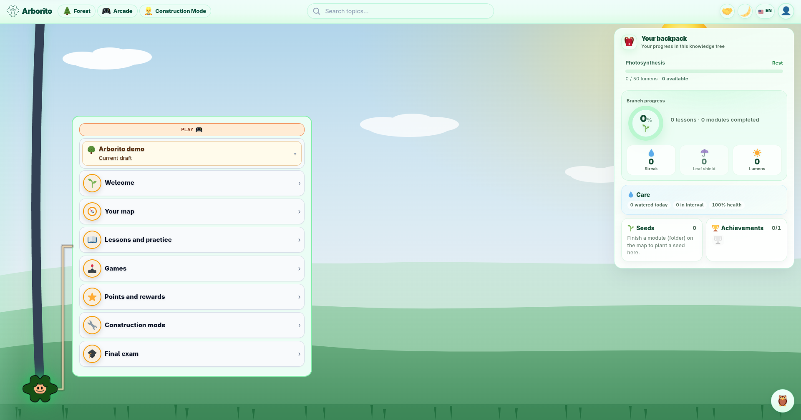
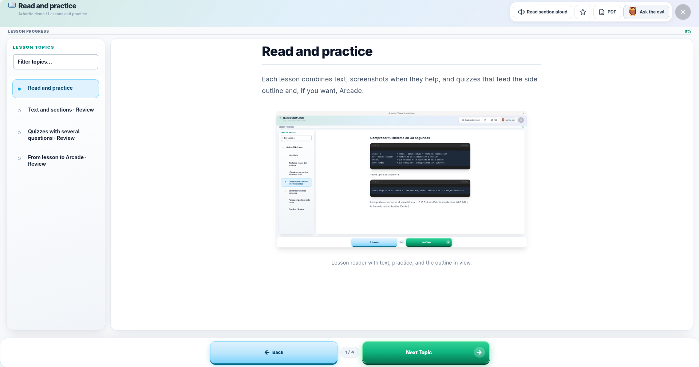
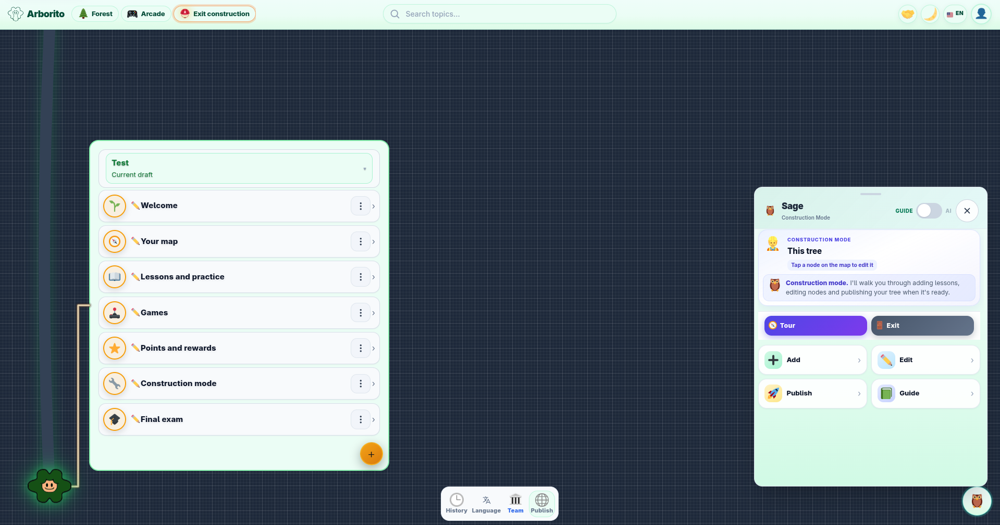
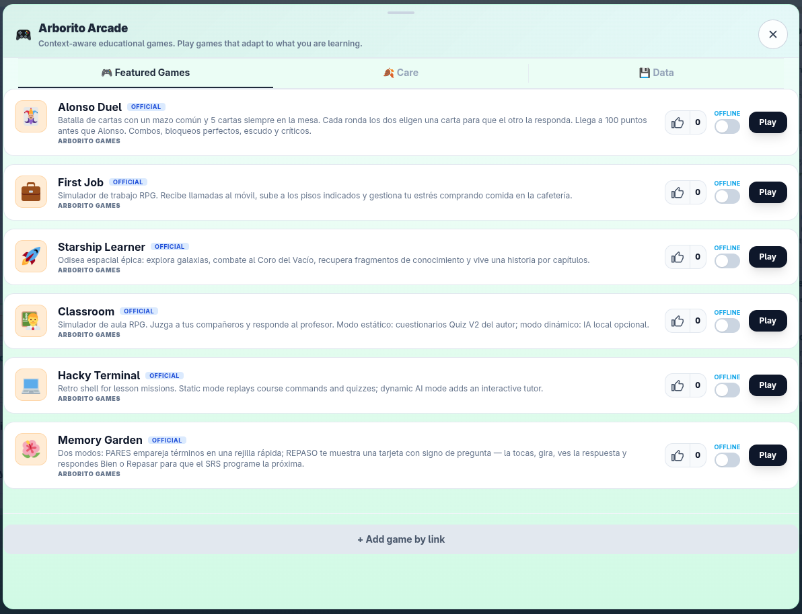

<p align="center">
 <a href="https://arborito.org"></a>
</p>

<h1 align="center">Arborito</h1>

<p align="center"><strong>Learn anything as an interactive tree of lessons. Free, open source, no ads.</strong></p>

<p align="center">
 <a href="https://arborito.org">Try it in the browser</a> ·
 <a href="https://github.com/treesys-org/arborito/releases">Download</a> ·
 <a href="https://treesys.org">Treesys</a>
</p>

Pick a subject, explore a visual map at your own pace, plant your own course, translate lessons, or remix what others published. No subscription, no mandatory account, no ads.

> **v0.1 alpha** at [arborito.org](https://arborito.org). Try it, tell us what confuses you, plant a tree, or contribute.

**Knowledge is a right, not a privilege.** Arborito is a **community project**, not a product catalogue. The goal is a forest everyone tends together.

## Try it now

**Easiest:** open **[arborito.org](https://arborito.org)** in your browser. Full app, no install.

**Optional install** (same Arborito, plus local Sage AI and voice on desktop): **More → Download app** inside Arborito, or get **Flatpak / Windows / Android APK** from [GitHub Releases](https://github.com/treesys-org/arborito/releases) (tag `v0.1.0-alpha`).

| Platform | Where |
|----------|--------|
| Web | [arborito.org](https://arborito.org) |
| Linux | `.flatpak` on [Releases](https://github.com/treesys-org/arborito/releases) |
| Windows | `.exe` installer on Releases |
| Android | `.apk` on Releases (not Play Store yet) |

## Screenshots

<p align="center">
 
</p>

<p align="center">
 
 
 
</p>

<p align="center"><em>Lesson map, reader, Construction, and Arcade. UI also available in Spanish.</em></p>

## Four pillars of the ecosystem

| Pillar | What it is |
|--------|------------|
| **Arborito** (this repo) | Web and desktop/mobile app: lesson maps, editor, memory garden, optional Arcade |
| **Public courses** | Publish and discover courses from the app: open network, no central catalogue |
| **Arborito Games** | Browser minigames via [`arborito-games`](https://github.com/treesys-org/arborito-games) (`window.arborito`) |
| **arborito-sdk** | Python SDK for scripts, CLIs, and apps outside the browser: [`pip install arborito-sdk`](https://github.com/treesys-org/arborito-sdk) (**0.2.2**) |

Each pillar evolves on its own. See [`ROADMAP.md`](ROADMAP.md) for where we are headed.

## What you can do today

- **Interactive lesson maps**: pick a branch, read, quiz, move on.
- **Lesson search**: finds modules and lessons in the open tree (works offline for local branches).
- **Memory garden**: spaced repetition via module seeds in your backpack.
- **Backpack** (desktop): growth, seeds, trophies, and lumens in the top-right panel.
- **Visual editor**: create lessons without code.
- **Lesson Arcade**: optional minigames tied to what you are learning.
- **Local-first**: progress stays on your device by default; optional online account (username + password, no email).
- **Shared courses**: content over the open network, HTTPS, or share links. No single company you depend on.
- **English & Spanish UI**: help translate in `locales/`.
- **Sage (optional, off by default)**: see [A short note on AI](#a-short-note-on-ai).

## Join the community

You do not need to code to help:

| You are… | You can… |
|----------|----------|
| Learner | Use [arborito.org](https://arborito.org), report what confuses you |
| Teacher | Plant a tree in Construction mode |
| Writer | Fix lessons and quizzes |
| Translator | Help with `locales/` |
| Developer | App, [`arborito-sdk`](https://github.com/treesys-org/arborito-sdk), or [`arborito-games`](https://github.com/treesys-org/arborito-games) |

**Where we hang out:** [Matrix (#arborito:matrix.org)](https://matrix.to/#/%23arborito:matrix.org) · [Reddit r/treesys](https://www.reddit.com/r/treesys/) · [YouTube](https://www.youtube.com/@Treesys-org) · [GitHub](https://github.com/treesys-org/arborito) · [Mastodon @treesys](https://mastodon.social/@treesys) · [treesys.org](https://treesys.org)

[`CONTRIBUTING.md`](CONTRIBUTING.md) has the friendly details. Developers: [`docs/DEVELOPMENT.md`](docs/DEVELOPMENT.md).

## Python SDK

Independent package in **[`arborito-sdk`](https://github.com/treesys-org/arborito-sdk)** (fourth pillar).

```bash
pip install arborito-sdk
pip install 'arborito-sdk[tui]' # enriched terminal lesson editor (F2 Quiz, forms)
arborito-cli branch import course.arborito
arborito-cli branch open "My Course"
arborito-cli shell
# list → go 1 → read → edit → quiz --rounds 10
```

- **In-app authoring:** Construction mode WYSIWYG (recommended for most authors).
- **Terminal authoring:** `arborito-cli edit`: block list + quiz forms, not raw `@quiz` fences (`edit --raw` for `$EDITOR`).

Docs: [`docs/PYTHON_SDK.md`](docs/PYTHON_SDK.md). Browser Arcade uses **`window.arborito`** (not this package). **Python SDK `0.2.2`** (initial release).

## Why we built it

1. **Free as in freedom (GPL v3)**: study the code, fork it, host it, modify it.
2. **Education over institution**: curricula from people who know the subject, not a publisher chasing a tender.
3. **No lock-in**: plain JSON lessons, open protocols. Progress is portable; an account is optional.
4. **Privacy-first**: no tracking, no ads. Optional AI stays under your control (local on desktop).
5. **Community curriculum**: software is soil, people are the forest.

## A short note on AI

**Sage** is optional, **off by default**, and never turns itself on.

| Where you run Arborito | Sage chat | Guide (no LLM) |
|------------------------|-----------|----------------|
| **Desktop app** | Local only: llama.cpp on your machine | On-device tips & navigation |
| **Web** | Optional Expert mode with your API key, or use desktop for private local AI | Same guide mode, no AI required |

Details: [`docs/PRODUCT_GUIDE.md`](docs/PRODUCT_GUIDE.md#web-vs-desktop), [`docs/AUTH_AND_ACCOUNT.md`](docs/AUTH_AND_ACCOUNT.md).

## Support the project (optional)

Arborito is **free software (GPL v3)**. If you find it useful, open **About → Community → Support Arborito**.

| | |
|---|---|
| **One-time** | [Stripe](https://buy.stripe.com/14AcN4aEr2y007SclL8N201) |
| **Monthly** (€2) | [Stripe](https://buy.stripe.com/eVqdR88wja0s6wg85v8N200) |

**Free ways to help:** star the repo, join [r/treesys](https://www.reddit.com/r/treesys/), plant a tree, or open a PR.

## Hack on the code

```bash
cd arborito
npm install
npm run dev # Vite dev server
npm run dev:electron # optional: Vite + Electron
```

See [`docs/DEVELOPMENT.md`](docs/DEVELOPMENT.md) for the repo map.

## Build releases (maintainers)

**On GitHub:** [Actions → Arborito Release](https://github.com/treesys-org/arborito/actions/workflows/arborito-release.yml) → **Run workflow**.

**Local:** `npm run setup:flatpak` (once) then `npm run release:build`. See [`docs/RELEASE.md`](docs/RELEASE.md).

## License

GNU **GPL v3**: see [`LICENSE`](LICENSE). Third-party notices: [`NOTICE`](NOTICE). Forks: [`docs/forking-and-branding.md`](docs/forking-and-branding.md).

---

**Treesys** hosts Arborito as open educational software. The forest grows with everyone who joins. [treesys.org](https://treesys.org)
